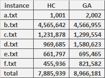

# Combinatorial optimization 2021/22 - The final labs project

* *Radosław Winiecki 148244 SI1*
* *Oskar Szudzik 148245 SI1*

## Prerequisites

* Python 3.9+
* pip 21.3.1+

## How to run the program:

1. Create virtual environment using `python -m venv env`.
2. Activate virtual environment by executing `env/Scripts/activate` on Linux or `env/Scripts/activate.ps1`on Windows.
3. Install required packages using `pip install -r requirements.txt`.
4. Run the program by typing:
    1. `python main.py simple` in the command line to run the simple algorithm version.
    2. `python main.py complex` in the command line to run the complex algorithm version.
5. Enter input data in `stdin` and have fun!

## Abstract

The problem we tried to solve was how to optimize traffic lights schedules for cars to pass their routes as fast as
possible. It was originally presented as a task on the online qualifications for Google Hash Code 2021.

## Implementation details

### Simple approach - Hill climbing

The approach we chose for the _simple_ algorithm relies on the hill climbing algorithm. Simply put, it looks for better
solutions until it can't find one. We start by setting all streets to 1 second. Then, we look
for [`HC_NEIGHBORS`](https://github.com/radswn/co-final-project/blob/64dc874588840f6eebfd8f69ad197b3b9962f8f7/algorithms.py#L14)
neighboring solutions - if none of them is better than the current, we finish the run.\
We chose this algorithm because it seemed easy to implement and could profit from only gradually increasing streets'
times, no sophisticated methods were needed for it to perform quite well.

### Complex approach - Genetic algorithm

The _complex_ approach works as follows. First, we create the initial population of solutions with all streets that are
used at least once set to 1. The individuals in this population differ by the order of those streets in each schedule.
Then, we perform evolution in a loop. In each population, we create new solutions by crossovers (parents are chosen with
a chance proportional to their fitness), and we expose them to mutation with a given
[probability](https://github.com/radswn/co-final-project/blob/64dc874588840f6eebfd8f69ad197b3b9962f8f7/algorithms.py#L15)
. The algorithm terminates after 300 second timeout. In the end, the best solution found is returned.\
\
We chose genetic algorithm, because the problem had the properties, that suggested this approach - easy crossovers and
mutations and also many individuals with various combinations of variables that could be easily represented as a
population. This approach gives us the opportunity to try out many settings. We tried numerous types of mutations and
population creating. After all of those experiments, we decided upon the most efficient parameters, and we stuck with it
till the end.

## Evaluation method used

We didn't commit to simulating the whole traffic for the instance duration as evaluation because of the absurd amount of
time it took. Instead, we designed an approximation algorithm, which took into account the expected value of waiting
time for every car.

* In every intersection, we calculate and add expected value of waiting time for a car
* We add travel time for each street the car passes.
* Finally, we assume this approximated time to be the total time of the travel and using the formula for the score, we
  count how many points it would get.

The other optimization we used is that before returning the best solution, we sort every intersection's schedule
according to the order of streets' appearance in routes.

## Results

\
Overall, genetic algorithm outperformed hill climbing approach by approx. 1 100 000 points total. The best improvements
were seen in instances d and f.

## Sources

* [the repository, which served as an inspiration in terms of classes layout](https://github.com/rocky1638/hashcode-2021)